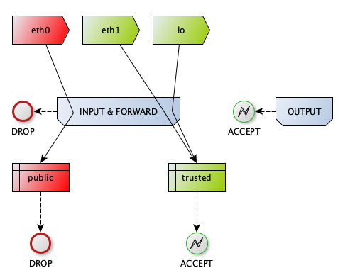
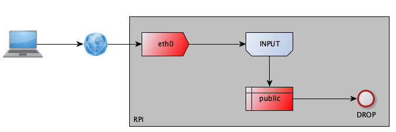
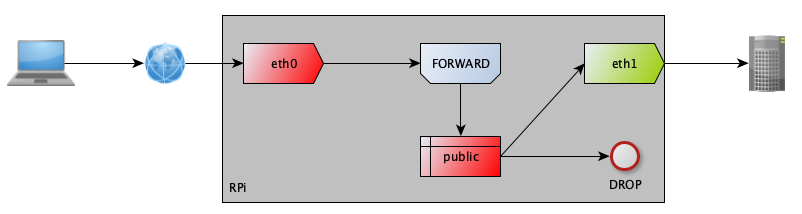
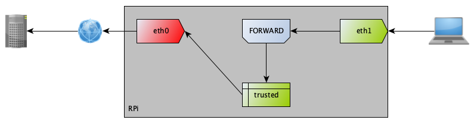

# pirewall: pi - er - wall

A Raspberry Pi based firewall.

pirewall is a utility that configures a fresh install of [Raspberry Pi OS Lite](https://www.raspberrypi.com/software/) to act as a firewall.  The pirewall binary is not in the data path — it simply configures the Linux kernel and services once, then steps out of the way.

At a high level: two network interfaces (built-in ethernet + a USB3 adapter) are used.  One faces the public internet (`eth0`) and the other faces the internal network (`eth1`).  NAT and iptables rules handle packet routing between them.  See the [iptables](#iptables) section for diagrams.

## Prerequisites

- A Raspberry Pi 4 (2 GiB recommended) with a USB3 network adapter for the second interface.  Pi 3 and Pi 5 should also work.
- The target OS is [Raspberry Pi OS Lite](https://www.raspberrypi.com/software/) 64-bit, based on Debian 12 (Bookworm) or Debian 13 (Trixie).
- WiFi and Bluetooth are disabled by pirewall — this is an intentional, opinionated choice.
- Two network interfaces are required:
  - if physical: the built-in ethernet adapter and a USB3-based network adapter.
  - vlans should work as well.

## Quick start

### 1. Flash the OS

Use the [Raspberry Pi Imager](https://www.raspberrypi.com/software/) to install Raspberry Pi OS Lite.  In the imager's advanced settings:

- Set a username **other than `pi`** (for security reasons)
- Add your SSH public key
- Disable SSH password authentication

### 2. Download and install pirewall

After booting the Pi, download the installer:

```bash
wget https://github.com/e4jet/pirewall/raw/refs/heads/main/pirewall-1.0.0-linux-arm64.install
```

Verify the checksum:

```bash
$ sha512sum pirewall-1.0.0-linux-arm64.install
b8d75e0c570b66d31dd401a927f549843db0678257d3131fc0354620d0f8e19b2ec6d89ce576a0d1e10ec9e1a27c5f19df8ccc1f65c1b225ce2e551e8ae76f7c pirewall-1.0.0-linux-arm64.install
```

Install it:

```bash
chmod 755 pirewall-1.0.0-linux-arm64.install
sudo ./pirewall-1.0.0-linux-arm64.install
___________________________________________________________________
|_|___|___|___|___|___|___|___|___|___|___|___|___|___|___|___|___|
|___|___|___|___|___|___|___|___|___|___|___|___|___|___|___|___|_|
|_|___|___|___|___|___|___|___|___|___|___|___|___|___|___|___|___|
|___|___|___|___|___|___|___|___|___|___|___|___|___|___|___|___|_|
|_|___|___|__|  ____  _                        _ _  |_|___|___|___|
|___|___|____| |  _ \(_)_ __ _____      ____ _| | | |___|___|___|_|
|_|___|___|__| | |_) | | '__/ _ \ \ /\ / / _` | | | |_|___|___|___|
|___|___|____| |  __/| | | |  __/\ V  V / (_| | | | |___|___|___|_|
|_|___|___|__| |_|   |_|_|  \___| \_/\_/ \__,_|_|_| |_|___|___|___|
|___|___|____|______________________________________|___|___|___|_|
|_|___|___|___|___|___|___|___|___|___|___|___|___|___|___|___|___|
|___|___|___|___|___|___|___|___|___|___|___|___|___|___|___|___|_|
|_|___|___|___|___|___|___|___|___|___|___|___|___|___|___|___|___|
|___|___|___|___|___|___|___|___|___|___|___|___|___|___|___|___|_|
pirewall installer

Extracting payload...
Installing pirewall -> /usr/local/bin/pirewall
Installing rebootOnWatchdog -> /usr/local/bin/rebootOnWatchdog
Installing examples -> /usr/local/share/pirewall/examples

Installation complete.
Example configuration files are in /usr/local/share/pirewall/examples
```

### 3. Run configuration

```bash
$ sudo pirewall -config
2026/03/09 22:13:37 INFO starting name=pirewall version=1.0.0
2026/03/09 22:13:37 INFO 👉 adjusting settings using raspi-config
2026/03/09 22:13:37 INFO running cmd="/usr/bin/raspi-config nonint do_blanking 0"
2026/03/09 22:13:37 INFO command succeeded cmd=/usr/bin/raspi-config
2026/03/09 22:13:37 INFO running cmd="/usr/bin/raspi-config nonint do_fan 0 14 80"
2026/03/09 22:13:37 INFO command succeeded cmd=/usr/bin/raspi-config
2026/03/09 22:13:37 INFO running cmd="/usr/bin/raspi-config nonint do_net_names 0"
2026/03/09 22:13:37 INFO command succeeded cmd=/usr/bin/raspi-config
2026/03/09 22:13:37 INFO running cmd="/usr/bin/raspi-config nonint do_change_locale en_US.UTF-8 UTF-8"
2026/03/09 22:13:46 INFO command succeeded cmd=/usr/bin/raspi-config
2026/03/09 22:13:46 INFO running cmd="/usr/bin/raspi-config nonint do_change_timezone America/New_York"
2026/03/09 22:13:46 INFO command succeeded cmd=/usr/bin/raspi-config
2026/03/09 22:13:46 INFO 👉 removing unwanted packages
2026/03/09 22:13:46 INFO running cmd="/usr/bin/apt-get purge -y --ignore-missing libx11.* libqt.* aardvark-dns wireless-* triggerhappy avahi-daemon"
2026/03/09 22:13:50 INFO command succeeded cmd=/usr/bin/apt-get
2026/03/09 22:13:50 INFO running cmd="/usr/bin/apt-get update"
2026/03/09 22:13:54 INFO command succeeded cmd=/usr/bin/apt-get
2026/03/09 22:13:54 INFO running cmd="/usr/bin/apt-get upgrade -y"
2026/03/09 22:13:57 INFO command succeeded cmd=/usr/bin/apt-get
2026/03/09 22:13:57 INFO running cmd="/usr/bin/apt-get autopurge -y"
2026/03/09 22:14:00 INFO command succeeded cmd=/usr/bin/apt-get
2026/03/09 22:14:00 INFO running cmd="/usr/bin/apt-get clean"
2026/03/09 22:14:00 INFO command succeeded cmd=/usr/bin/apt-get
2026/03/09 22:14:00 INFO 👉 adding useful packages
2026/03/09 22:14:00 INFO running cmd="/usr/bin/apt-get update"
2026/03/09 22:14:04 INFO command succeeded cmd=/usr/bin/apt-get
2026/03/09 22:14:04 INFO running cmd="/usr/bin/apt-get upgrade -y"
2026/03/09 22:14:07 INFO command succeeded cmd=/usr/bin/apt-get
2026/03/09 22:14:07 INFO running cmd="/usr/bin/apt-get install -yqq bmon"
2026/03/09 22:14:10 INFO command succeeded cmd=/usr/bin/apt-get
2026/03/09 22:14:10 INFO running cmd="/usr/bin/apt-get install -yqq dnsmasq"
2026/03/09 22:14:12 INFO command succeeded cmd=/usr/bin/apt-get
2026/03/09 22:14:12 INFO running cmd="/usr/bin/apt-get install -yqq dnsutils"
2026/03/09 22:14:15 INFO command succeeded cmd=/usr/bin/apt-get
2026/03/09 22:14:15 INFO running cmd="/usr/bin/apt-get install -yqq iptables-persistent"
2026/03/09 22:14:17 INFO command succeeded cmd=/usr/bin/apt-get
2026/03/09 22:14:17 INFO running cmd="/usr/bin/apt-get install -yqq git"
2026/03/09 22:14:20 INFO command succeeded cmd=/usr/bin/apt-get
2026/03/09 22:14:20 INFO running cmd="/usr/bin/apt-get install -yqq unattended-upgrades"
2026/03/09 22:14:23 INFO command succeeded cmd=/usr/bin/apt-get
2026/03/09 22:14:23 INFO running cmd="/usr/bin/apt-get install -yqq apt-listchanges"
2026/03/09 22:14:25 INFO command succeeded cmd=/usr/bin/apt-get
2026/03/09 22:14:25 INFO running cmd="/usr/bin/apt-get install -yqq vlan"
2026/03/09 22:14:28 INFO command succeeded cmd=/usr/bin/apt-get
2026/03/09 22:14:28 INFO running cmd="/usr/bin/apt-get install -yqq netplan.io"
2026/03/09 22:14:31 INFO command succeeded cmd=/usr/bin/apt-get
2026/03/09 22:14:31 INFO running cmd="/usr/bin/apt-get install -yqq ddclient"
2026/03/09 22:14:33 INFO command succeeded cmd=/usr/bin/apt-get
2026/03/09 22:14:33 INFO running cmd="/usr/bin/apt-get install -yqq nload"
2026/03/09 22:14:36 INFO command succeeded cmd=/usr/bin/apt-get
2026/03/09 22:14:36 INFO running cmd="/usr/bin/apt-get install -yqq iftop"
2026/03/09 22:14:38 INFO command succeeded cmd=/usr/bin/apt-get
2026/03/09 22:14:38 INFO 👉 enabling new services
2026/03/09 22:14:38 INFO running cmd="/usr/bin/systemctl start unattended-upgrades"
2026/03/09 22:14:39 INFO command succeeded cmd=/usr/bin/systemctl
2026/03/09 22:14:39 INFO running cmd="/usr/bin/systemctl enable unattended-upgrades"
2026/03/09 22:14:41 INFO command succeeded cmd=/usr/bin/systemctl
2026/03/09 22:14:41 INFO 👉 disabling unneeded services
2026/03/09 22:14:41 INFO running cmd="/usr/bin/systemctl stop bluetooth"
2026/03/09 22:14:41 INFO command succeeded cmd=/usr/bin/systemctl
2026/03/09 22:14:41 INFO running cmd="/usr/bin/systemctl disable bluetooth"
2026/03/09 22:14:43 INFO command succeeded cmd=/usr/bin/systemctl
2026/03/09 22:14:43 INFO running cmd="/usr/bin/systemctl stop sound.target"
2026/03/09 22:14:43 INFO command succeeded cmd=/usr/bin/systemctl
2026/03/09 22:14:43 INFO running cmd="/usr/bin/systemctl disable sound.target"
2026/03/09 22:14:44 INFO command succeeded cmd=/usr/bin/systemctl
2026/03/09 22:14:44 INFO 👉 adjusting /etc/sysctl.conf
2026/03/09 22:14:44 INFO done name=pirewall
```

### 4. Copy example config files

Copy the files from the [examples directory](#examples) to their destinations on the Pi.  At minimum you will need:

- Network config: [01-network.yaml](install/examples/01-network.yaml) → `/etc/netplan/`
- Firewall rules: [rules.v4](install/examples/rules.v4) and [rules.v6](install/examples/rules.v6) → `/etc/iptables/`
- DNS/DHCP: [dns.conf](install/examples/dns.conf) and [dhcp.conf](install/examples/dhcp.conf) → `/etc/dnsmasq.d/`

Edit each file to match your network before applying.

### 5. Set up config backup

Initialize a git repo for config backups (replace `youruser` with your username):

Add entries to root's crontab (`sudo crontab -e`) to back up the config and watch for network watchdog errors:

```crontab
* * * * * /usr/local/bin/pirewall -backup youruser > /tmp/backupConfig 2>&1
* * * * * /home/youruser/bin/rebootOnWatchdog > /var/tmp/rebootOnWatchdog 2>&1
```

## Why Build This?

I manually rebuild my personal firewall every few years.  The Raspberry Pi devices and Debian-based OSes have proven quite good.  The basics don't change, so I've automated them.  This should allow others to leverage this.

## Why not Ansible (or insert your favorite tool)?

I'm a big fan of Ansible, however it is overkill for what I'm after here.  The goal of this project is to drop off a tiny binary that configures a Raspberry Pi for use as a firewall.

## Why iptables and not nftables?

My provider doesn't support ipv6 yet, nor does it provide enough bandwidth to make some of the efficiencies of nftables worth the switch.  I'm sure we'll get there eventually, but for now, the [tables](install/examples/rules.v4) configured in pirewall are tried and trusted.

## Project TODOs

### Config

- [X] Packages that are not needed are removed
- [X] Packages that are needed are added
- [X] New Services are started and enabled
  - unattended-upgrades
- [X] Old Services are stopped and disabled
  - bluetooth
  - sound.target
- [X] The kernel is configured for packet routing and safety
- [X] The example configurations are included
- [X] Device is configured
- [ ] Automate service fixes
- [ ] Configure the network automatically
- [ ] Basic QOS

## Examples

The examples directory contains configuration file templates.  Copy and edit each file to match your environment before using.

- [rules.v4](install/examples/rules.v4) — iptables rule set for ipv4
  - copy to `/etc/iptables`
- [rules.v6](install/examples/rules.v6) — iptables rule set for ipv6 (drops everything)
  - copy to `/etc/iptables`
- [dns.conf](install/examples/dns.conf) — basic DNS settings for dnsmasq
  - copy to `/etc/dnsmasq.d`
- [dhcp.conf](install/examples/dhcp.conf) — basic DHCP settings for dnsmasq
  - copy to `/etc/dnsmasq.d`
- [01-network.yaml](install/examples/01-network.yaml) — basic 2-interface network config; one interface uses a static IP (internal), the other uses DHCP (ISP/public)
  - copy to `/etc/netplan`

## netplan

[Raspberry Pi OS](https://www.raspberrypi.com/software/) comes with [Network Manager](https://networkmanager.dev/).  [NetPlan](https://netplan.readthedocs.io/en/stable/) can use Network Manager as a backend.  This project uses [NetPlan](https://netplan.readthedocs.io/en/stable/) for interface management, which makes it straightforward to configure advanced features like VLANs and bridges.

## iptables

Network Address Translation (NAT) is used by the firewall to allow multiple hosts behind the firewall to share a single public IP address (assigned to eth0).

The following diagram depicts the association between tables and interfaces in the default [ruleset](iptables/rules.v4_example).



When a packet is destined for the firewall itself, it is handled by the INPUT table, which defaults to DROPping the packet.  The first rule in the INPUT table jumps to the "public" chain when a packet arrives on eth0.  That chain determines whether the packet is ACCEPTED, REJECTED, or DROPPED.  In most cases it is DROPPED, since the firewall does not provide services to the outside world.



When a packet is destined for a host behind the firewall, it is handled by the FORWARD table (also defaulting to DROP).  The first rule jumps to the "public" chain for packets arriving on eth0.  If ACCEPTED, the packet is translated (NAT) and routed to the internal host.



When an internal host sends a packet to the public network, the FORWARD table handles it as well.  A rule jumps to the "trusted" chain for packets arriving on eth1 (the internal interface).  If ACCEPTED, the packet is translated and routed out to the public network.



## dnsmasq

[dnsmasq](https://thekelleys.org.uk/dnsmasq/doc.html) is a lightweight, versatile tool for DNS and DHCP in small to medium-sized networks.  It is installed and ready to be configured via the files in [install/examples/](install/examples/).

## ddclient

[ddclient](https://ddclient.net/) updates dynamic DNS records automatically when your public IP changes — useful when your ISP does not provide a static IP.  It is installed and ready to be configured.

## Utilities

### rebootOnWatchdog

`bin/rebootOnWatchdog` is a script intended to be run from cron.  It uses `journalctl` to watch for watchdog errors on network devices and reboots the OS (`init 6`) if any are found.  It also ensures sshd has started.

### backup

The `pirewall -backup <username>` combination copies live config files into `~<username>/.pirewall` and commits them to git.  To add a file to the backup, touch the corresponding file in the ~/.pirewall directory.  Make sure you trust the user that this is configured for, they can get access to any file using this process.

Example run:

```bash
$ sudo pirewall -backup youruser
cp /etc/netplan/01-network.yaml /home/youruser/.pirewall/etc/netplan/01-network.yaml  ...Success.
cp /etc/sysctl.conf /home/youruser/.pirewall/etc/sysctl.conf  ...Success.
cp /etc/ddclient.conf /home/youruser/.pirewall/etc/ddclient.conf  ...Success.
cp /etc/dnsmasq.d/host.local /home/youruser/.pirewall/etc/dnsmasq.d/host.local  ...Success.
cp /etc/dnsmasq.d/dns.conf /home/youruser/.pirewall/etc/dnsmasq.d/dns.conf  ...Success.
cp /etc/dnsmasq.d/dhcp.conf /home/youruser/.pirewall/etc/dnsmasq.d/dhcp.conf  ...Success.
cp /etc/ssh/sshd_config /home/youruser/.pirewall/etc/ssh/sshd_config  ...Success.
cp /etc/iptables/rules.v6 /home/youruser/.pirewall/etc/iptables/rules.v6  ...Success.
cp /etc/iptables/rules.v4 /home/youruser/.pirewall/etc/iptables/rules.v4  ...Success.
chmod -R 700 /home/youruser/.pirewall ...Success.
chown -R youruser /home/youruser/.pirewall ...Success.
[master (root-commit) d738497] auto commit
 10 files changed, 344 insertions(+)
 create mode 100755 etc/ddclient.conf
 create mode 100755 etc/dnsmasq.d/dhcp.conf
 create mode 100755 etc/dnsmasq.d/dns.conf
 create mode 100755 etc/dnsmasq.d/host.local
 create mode 100755 etc/iptables/rules.v4
 create mode 100755 etc/iptables/rules.v6
 create mode 100755 etc/netplan/01-network.yaml
 create mode 100755 etc/ssh/sshd_config
 create mode 100755 etc/sysctl.conf
 create mode 100755 var/lib/misc/dnsmasq.leases
```

### Tools

#### bmon

[bmon](https://github.com/tgraf/bmon) is a bandwidth monitor and rate estimator.  It is useful for watching real-time traffic on each interface while diagnosing network issues.

```bash
/usr/bin/bmon
```

## Cleanup

### sshd

Restrict sshd to listen only on the private interface so it is not reachable from the public internet:

```bash
$ grep ListenAddress /etc/ssh/sshd_config
ListenAddress 10.10.10.1
```

### config cron

Use root's crontab to back up the configuration automatically (replace `youruser` with your username):

```bash
sudo crontab -e
```

```crontab
* * * * * /usr/local/bin/pirewall -backup youruser > /tmp/backupConfig 2>&1
* * * * * /home/youruser/bin/rebootOnWatchdog > /var/tmp/rebootOnWatchdog 2>&1
```

### Fix systemd targets

Some services start before the network is fully online.  Fix this by changing `network.target` to `network-online.target` in:

- `/etc/systemd/system/multi-user.target.wants/ssh.service`
- `/etc/systemd/system/multi-user.target.wants/dnsmasq.service`
